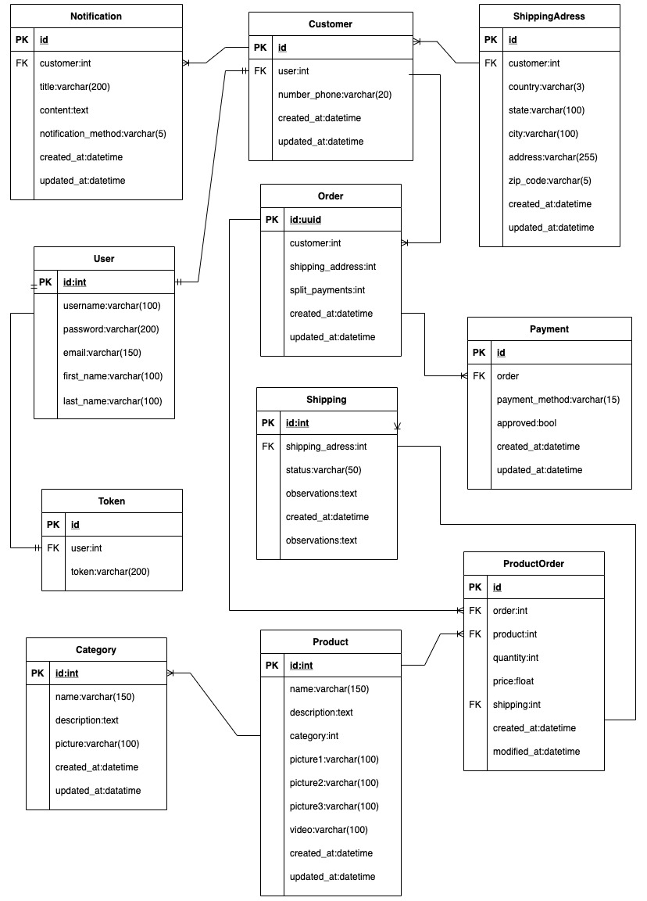

# Overview 
A company requires a relational database to manage users, products, orders, payments, and shipments. Please refer only to the minimum needed attributes for an e-commerce flow.

# Scope

## Use cases 

## Out to scope

---

## Architecture
### Entity Relational Modeling

### Endpoints 
- Products -> `/api/products/`
